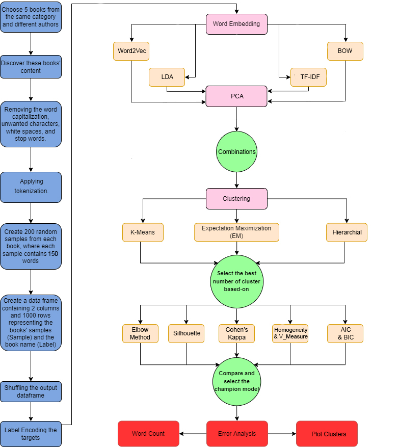
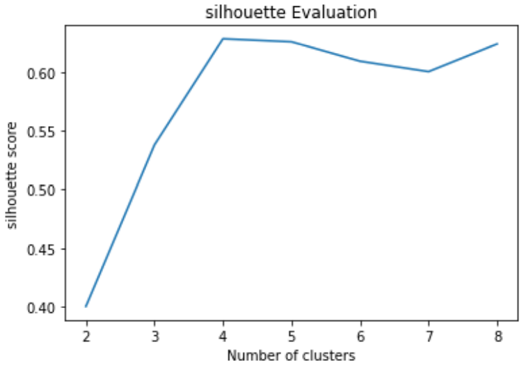
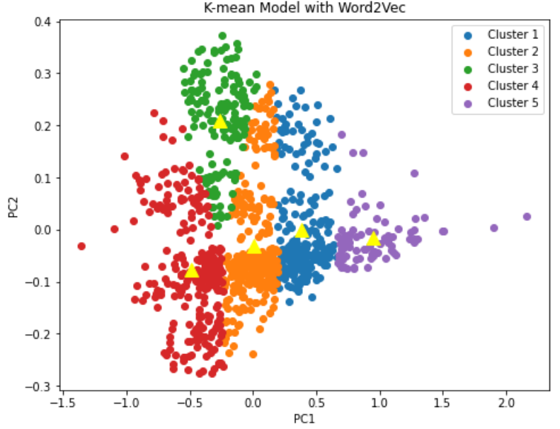

# Gutenberg Books Clustering

# Table of Contents

[Objective](#1)

[Team Members](#2)

[Overview](#3)

[Project Methodology](#4)

[Dataset](#5)

- [Data Preprocessing](#6)
- [Dataset Building](#7)

[Word Embedding](#8)

- [BOW](#9)
- [TF-IDF](#10)
- [Word2Vec](#11)
- [LDA](#12)
- [PCA](#13)
- [Visualization After PCA](#14)

[Models and Evaluation](#15)

- [K-Means](#16)

- [Expectation Maximization (EM)](#17)

- [Hierarchical Clustering](#18)

- [Coherence for LDA](#19)

[Result](#20)

[Error Analysis](#21)

# <a name ="1">Objective</a>

The project was part of our AI & Data Science Master's degree at the University of Ottawa. 

Kaggle link: [Link](https://www.kaggle.com/code/mostafanofal/gutenberg-book-clustering)

Check all the projects here: [Link](https://github.com/Mostafanofal453)

# <a name = "2">Team Members </a>

[Gehad Hisham](https://www.linkedin.com/in/gehad-hisham/)

[Kareem Bakli](https://www.linkedin.com/in/kareem-bakli-b48228138/)

[Kareem Khaled](https://www.linkedin.com/in/kareemwaly/)

[Mostafa Nofal](https://www.linkedin.com/in/mostafa-nofal-772625194/)

# <a name = "3">Overview</a>

**Project Gutenberg is a library of over 60,000 free eBooks**


[ // ]: # "![image]&#40;https://drive.google.com/uc?export=view&id=1rba73ZNjop-72Y1_0AEWAiFbqrUysa7V;"

In this project, we selected some books from the Gutenberg library from different categories using NLTK and then select random paragraphs from them and labeled these paragraphs by the book name for ground truth. After creating the dataset we used many transformation algorithms to embed the text to numbers for the modeling processes like BOW, TF-IDF, LDA, and Word-Embedding with PCA to be able to plot.
<br>

<br>After this, we tried many clustering algorithms like K-means, Expected-maximization (EM), and Hierarchical to choose the champion one which achieved the kappa and silhouette score.

# <a name = "4">Project Methodology</a>



[ // ]: # "![image]&#40;https://drive.google.com/uc?export=view&id=1UBZ-K43IPGQ5qjeSWLN1s2mfpldP3A6q;"

# <a name = "5">Dataset</a>

We scrapped 5 books with with different authors and different genres:

- Austen-emma
- Bible-kjv
- Chesterton-brown
- Shakespeare-caesar 
- Blake-poems

## <a name="6">Data Preprocessing</a>

**Clean the content of the books by:**

- Converted the text to lower case
- Removed any special characters
- Used RegexpTokenizer to tokenize the text. 
- Created our stop words list and removed from our text
- Remove single char, and chars with size 2

## <a name = "7">Dataset Building</a>

We created 200 partitions of each book text, each partition contains 150 words

We come out with a DataFrame contains: 

- Partitions columns
- Author column. 
- The title of the book column labeled as a,b,c,d,e. 

**Note:** Before starting to transform words. We split the data into training and testing, to prevent data leakage.


# <a name="8">Word Embedding</a>

It is one of the trivial steps to be followed for a better understanding of the context of what we are dealing with. After the initial text is cleaned and normalized, we need to transform it into features to be used for modeling.

## <a name="9">BOW</a>

A bag of words is a representation of text that describes the occurrence of words within a document, just keeps track of word counts and disregard the grammatical details and the word order. As we said that we split the data. So, we applied BOW to training and testing data. So, it transforms each sentence into an array of occurrences in this sentence.
```Python
from sklearn.feature_extraction.text import CountVectorizer
def bow_emb(data):
    count_vectorizer = CountVectorizer()
    emb = count_vectorizer.fit_transform(data)
    return emb, count_vectorizer

X_train_bow_emb, count_vectorizer = bow_emb(X_train)
X_test_bow_emb = count_vectorizer.transform(X_test)
```
## <a name="10">TF-IDF</a>

 TF-IDF (term frequency-inverse document frequency) is a statistical measure that evaluates how relevant a word is to a document in a collection of documents. This is done by multiplying two metrics: how many times a word appears in a document, and the inverse document frequency of the word across a set of documents.

```Python
from sklearn.feature_extraction.text import TfidfVectorizer

def tfidf(data):
    tfidf_vectorizer = TfidfVectorizer()
    train = tfidf_vectorizer.fit_transform(data)  
    return train, tfidf_vectorizer

X_train_tfidf_emb, tfidf_vectorizer = tfidf(X_train)
X_test_tfidf_emb = tfidf_vectorizer.transform(X_test)
```

  ## <a name="11">Word2Vec</a>

- Word2vec is a method to represent each word as a vector.
- Doc2Vec is a method for representing a document as a vector and is built on the word2vec approach.

```python
from gensim.test.utils import common_texts
from gensim.models.doc2vec import Doc2Vec, TaggedDocument

def word_embedding(data):
  docs = [d for d in data['value']]
  documents = [TaggedDocument(doc, [i]) for i, doc in enumerate(docs)]

  vec_size = 50
  alpha = 0.025
  d2v_model = Doc2Vec(vector_size=vec_size,
                  alpha=alpha, 
                  min_alpha=0.0025,
                  min_count=1,
                  dm =1)
  d2v_model.build_vocab(documents)
  d2v_model.train(documents, total_examples=d2v_model.corpus_count, epochs=d2v_model.epochs)
  d2v=d2v_model.docvecs.doctag_syn0
  return d2v

x_doc2vec = word_embedding(booksPartions_df)
x_doc2vec
```

## <a name="12">LDA</a>

LDA is statistical model for discovering the abstract *topics* and used for topic modeling.

```python
from sklearn.decomposition import LatentDirichletAllocation

def LDA(data):

  count_vect = CountVectorizer()
  X_t = count_vect.fit_transform(data)
  lda = LatentDirichletAllocation(n_components=5,random_state=0) 
  LDA_out= lda.fit_transform(X_t)
  features_name = lda.components_
  return LDA_out,  features_name

x_LDA, names = LDA(books)
```

## <a name="13">PCA</a>

We used PCA to reduce the number of features of every one of the four vectorizers to plot them in 2d.

```python
from sklearn.decomposition import PCA
def calc_PCA(books,_2Dtransformed_data,title,flag=0):
  if flag==0:
    count =_2Dtransformed_data.fit_transform(books).todense()
  else:
    count=_2Dtransformed_data

  pca = PCA(n_components=2)
  pca.fit(count)
  _2Dtransformed_data=pca.transform(count)
  print(title,_2Dtransformed_data.shape)
  plt.scatter(_2Dtransformed_data[:, 0], _2Dtransformed_data[:, 1])
  plt.title(title)
  return _2Dtransformed_data
```

## <a name="14">Visualization After PCA</a>

| BOW                      | TF-IDF                   |
| ------------------------ | ------------------------ |
|  |  |

| LDA                      | Word2Vec                 |
| ------------------------ | ------------------------ |
|  |  |


# <a name="15">Models and Evaluation</a>

## <a name="16">K-Means</a>

K-Means is an unsupervised machine learning algorithm in which each observation belongs to the cluster with the nearest mean.

<br>

For consistency, we used homogenity and v_score to measure the similarity in cluster for every model

|              |       Elbow Method        |     Silhouette Method     |       Clusters Plot       | Cohen's Kappa | Silhouette Score | Homogeneity Score | V_Measure Score |
| ------------ | :-----------------------: | :-----------------------: | :-----------------------: | :-----------: | :--------------: | :---------------: | :-------------: |
| **BOW**      |   |   |  |     0.71      |      0.045       |       0.73        |       0.8       |
| **TF-IDF**   |  |  |  |     0.74      |       0.04       |       0.82        |       0.9       |
| **LDA**      |  |  |  |     0.66      |       0.62       |       0.58        |      0.63       |
| **Word2Vec** |  |  |  |     0.37      |       0.32       |       0.26        |      0.29       |

Best transformation with K-means algorithm is Tf-Idf 

- Kappa for the model at n_clusters= 5 is 0.745 

- Best Value for n cluster is = 5 The average silhouette_score : 0.0438 

- For n_clusters = 5 The silhouette_score : 0.0406 

- For n_clusters = 5 The homogeneity_score : 0.8138 

- For n_clusters = 5 The v_measure_score : 0.8913

## <a name = "17">Expectation Maximization (EM)</a>

Expectation Maximization (EM) clustering is to estimate the means and standard deviations for each cluster to maximize the likelihood of the observed data.

|              |        AIC and BIC        |       Clusters Plot       | Cohen's Kappa | Silhouette Score | Homogeneity Score | V_Measure Score |
| ------------ | :-----------------------: | :-----------------------: | :-----------: | :--------------: | :---------------: | :-------------: |
| **BOW**      |  |  |     0.72      |      0.033       |       0.73        |      0.79       |
| **TF-IDF**   |  |  |     0.74      |       0.04       |       0.81        |      0.89       |
| **LDA**      |  |  |      0.3      |       0.15       |       0.24        |       0.3       |
| **Word2Vec** |  |  |     0.37      |       0.3        |       0.26        |      0.29       |

Best transformation with EM is Tf-Idf 

- Kappa for the EM model at number of Cluster 5 is 0.7463 

- For n_clusters = 5 The average silhouette_score : 0.4 

- For n_clusters = 5 The homogeneity_score : 0.8167 

- For n_clusters = 5 The v_measure_score : 0.8944

## <a name = "18">Hierarchical Clustering</a>

Hierarchical clustering is an algorithm that groups similar objects into groups. The endpoint is a set of clusters, where each cluster is distinct from the other cluster, and the objects within each cluster are broadly like each other.

|              |      Dendrogram plot      |       Clusters Plot       | Cohen's Kappa | Silhouette Score | Homogeneity Score | V_Measure Score |
| ------------ | :-----------------------: | :-----------------------: | :-----------: | :--------------: | :---------------: | :-------------: |
| **BOW**      |  |  |     0.68      |      0.043       |         1         |      0.77       |
| **TF-IDF**   |  |  |     0.73      |       0.04       |         1         |      0.86       |
| **LDA**      |  |  |     0.66      |       0.61       |         1         |      0.63       |
| **Word2Vec** |  |  |     0.24      |       0.27       |         0         |      0.14       |

Best transformarion with Hierachy is Tf-Idf 

- Kappa for the Hierarchy model at number of Cluster 5 is 0.73375 

- For n_clusters = 5 Silhouette Coefficient is: 0.0403 

- For n_clusters = 5 The homogeneity_score : 1 

- For n_clusters = 5 The v_measure_score : 0.8693

## <a name="19">Coherence for LDA</a>

We calculated coherence for LDA from gensim:

<br>

Selecting the best number of topic modeling for coherence


Best coherence value is: -1.82 at 3 number of topic modeling

# <a name = "20">Result</a>

We have 12 models on all of our transformation methods. We compared our models by its Kappa scores, coherence, and silhouette and the best model was K-Means Algorithm with Tf-Idf

- Kappa for the model at n_clusters= 5 is 0.745

- Best Value for n cluster is = 5 The average silhouette_score : 0.0438

- For n_clusters = 5 The silhouette_score : 0.0406

- For n_clusters = 5 The homogeneity_score : 0.8138

- For n_clusters = 5 The v_measure_score : 0.8913


**Clusters Vs the original data labels**


# <a name="21">Error Analysis</a>
- We looked at each cluster in our chosen champion model, and visualize how they cluster the books, and how much data they managed to cluster, and tried to find the most frequent words (10 words) in each cluster. 

- We compared the most frequent words in each cluster and find the most similar ones. 
- We found that the clusters separate the docs well, and in the most occurred words, there is no big conflict between the clusters. 
- So, we searched for the paragraphs that the model failed to cluster right and print the most occurred words. 
- We want to reduce the similarity between each cluster, the more the cluster are far from each other, the more the model is good 
- The words that appear in many clusters are the ones that confuse our model, and that led to increase the error in it.

Applying this K-Means model with Tf-IDF:

- We made a data frame contains each word with its TF IDF values and what the number of the cluster it was belong to. 


- We get the most occurred words in each cluster (0:4)


We can see that cluster two was confused with clustering, it clusters data that should be in cluster 1 and 0.

<br>

|           | Most 10 Frequent words in each Cluster: |
| --------- | --------------------------------------- |
| Cluster 0 |                |
| Cluster 1 |                |
| Cluster 2 |                |
| Cluster 3 |                |
| Cluster 4 |                |

We can see that There is common words in cluster 2, 1, 0 that made the error drop down.
